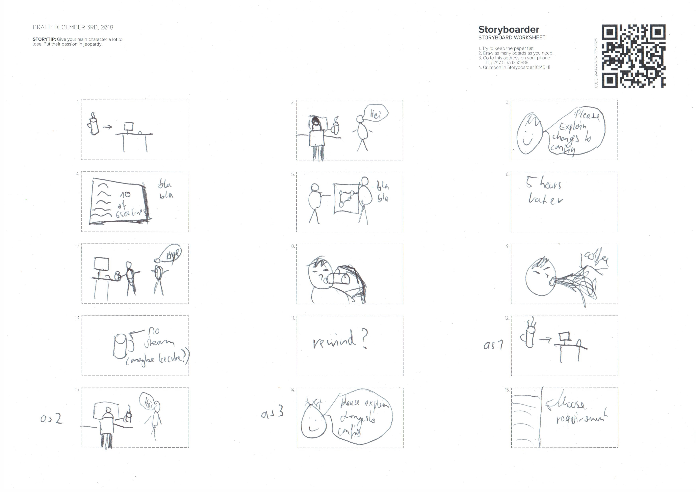
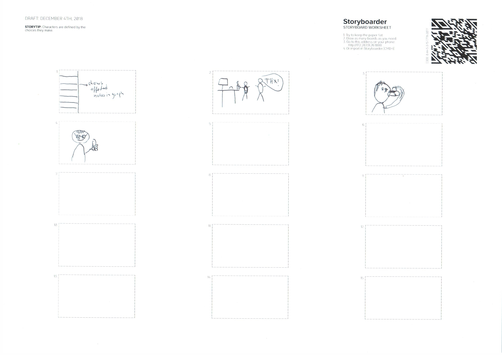

# Programmable Networks, Group 2
#### Miro Haller, Roger Baumgartner, Tim Matter, Jules Bachmann and Jan Urech

## Project description
### Problems the user faces
- Non-intuitive interaction with topology, low-level router configuration needed
- Manual changes have hard to predict outcomes
- Error-prone maintenance and update process
- No way to directly specify high-level requirements

### Goals of our project
Given a high-level network property and a network topology, figure out how to visualize to the user how the property affects the network configuration.

### Notes from first meeting
[Preparation Notes](resources/first_meeting/preparation.docx)  
[Debrief Notes](resources/first_meeting/debrief.docx)

## Ideas

### Personas

[David Fischer, Junior Network Engineer](resources/personas/David%20Fischer.md)  
[Hans-Peter Dullinger, Senior Network Engineer](resources/personas/Hans-Peter%20Dullinger.md)

### High-level properties of the network
We were asked by our stakeholder to derive the properties which we should later visualize. [Here](resources/ideation/requirements.md) is a list of what we found in various papers and projects.

### 50 Thoughts

[Image of our cards](img/ideation/50_thoughts.jpg)

### Concrete ideas

[Split screen: Controls + Graph](resources/ideation/3_ideas.md#split-screen-controls--graph)  
[Social media for network graphs](resources/ideation/3_ideas.md#social-media-for-network-graphs)  
[Full screen network graph](resources/ideation/3_ideas.md#full-screen-network-graph)

### Deliverables
[Programmable networks: 3 ideas PPT presentation](Deliverables/Idea_Presentation.pptx) [(pdf)](Deliverables/Idea_Presentation.pdf)

## Evaluation

### Paper prototype

Here's a video of our paper prototype in action:  
  
([Direct download](video/paper_prototype.mp4))

### Deliverables
[Study Report](Deliverables/Study_Report.md)

## Final solution
Since our paper prototype, we did two more iterations on the UI. One from the paper prototype to the clickable mockup (which we used for our study) and another for the video prototype. The changes are described [in this document](resources/video_prototype/iterative_changes.md).

### Video showcasing our prototype
The general idea of our video was to show two scenarios. In both we first motivate our solution by showing the problem it solves. Then in the second part of each scenario we show how this action looks in our prototype specifically.

#### Storyboards

Here is the storyboard for the first scenario:

And here is the storyboard of the second scenario:

#### Final submission

(**[Direct download of the video showcasing our prototype](Deliverables/Programmable_Networks_video_prototype.mp4)**)
