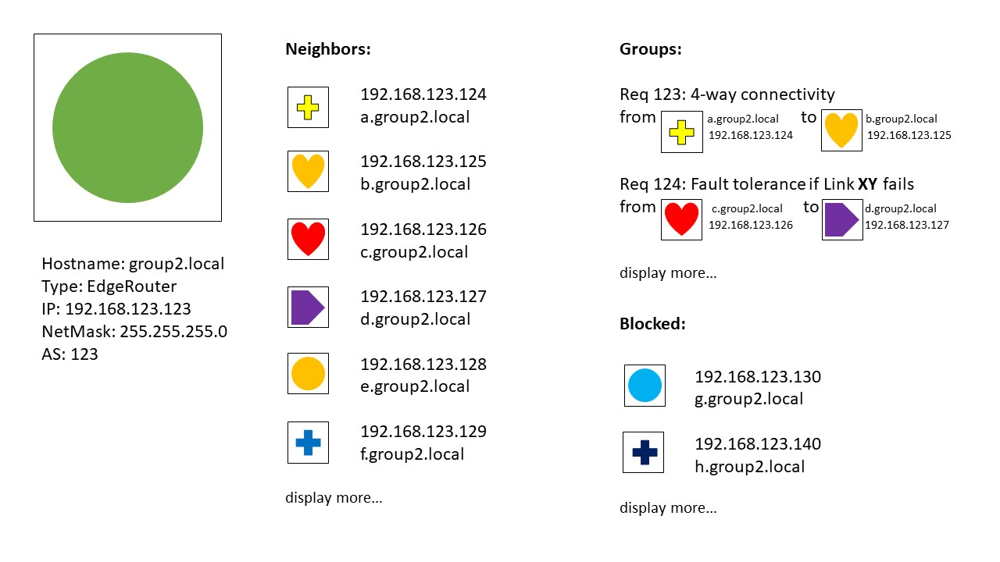
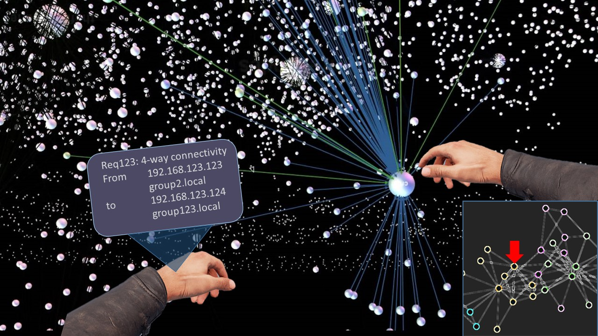

# Ideas
## Social media for network graphs

- There is a profile for each network node (AS, router)
 - General information (IP, hostname, router type, ...) is listed in the profile
 - Profile pictures are symbols for different router types, maybe also sizes (e.g. star for AS, larger ASes have more points, maybe with a logarithmic scale)
 - Relations of nodes are listed as friendship relations
  - Direct neighbours are friends
  - Forbidden paths are blocked friends
- Requirements are groups
 - On the profile of a node you see in which groups it is, i.e. which requirements affect that node
 - There is a site for each groups, showing its members and general information about that requirement

## Full screen network graph

- The graph spans over the full screen
- You can zoom in
 - E.g. ASes are bundled into a symbol, if you select it, you see the internal nodes and network
 - Maybe you can also group nodes yourself (e.g. geographical groups like cities or logical groups like departments) with Photoshop-like tools (lasso to select nodes)
- There is a minimap that shows you where you are in the full graph
- Virtual reality
 - Inspect element: If you point with the right hand on a node, you see an info panel on your left arm, which show which requirements affect that node and other information (like its routing table)
- Page rank like scaling
 - E.g. to show distance: When you select a node, that node gets larger. Its neighbors are also larger, but a bit smaller. Nodes that are connected over two edges are again a bit smaller and so on.
 - Alternative you could also make nodes with many edges larger, and like page rank give nodes with many edges more weight i.e. an edge from such a node gives you more importance (size) than from a node with few connections.

## Split screen: Controls + Graph
- The left part of the screen (maybe a third) is filled with general controls and the requirements, on the right side is the network graph
- You can select a requirement on the left, then the graph on the right side highlights the nodes that are affected by that requirement. E.g. for N-connectivity from A to B it shows all N paths and fades out the others.
- You can also select nodes on the right and then it shows you informations about that node on the left (general infos, requirements that affect it, ...)
- Maybe you have tabs for different requirements / functionality in the left panel
- Graph can be colour coded to show e.g. preferences of paths
- We also have regions defined in the graph for scalability (e.g. AS complexity hidden if not needed)

## General
All ideas need:
- Some search functionality
- ...
